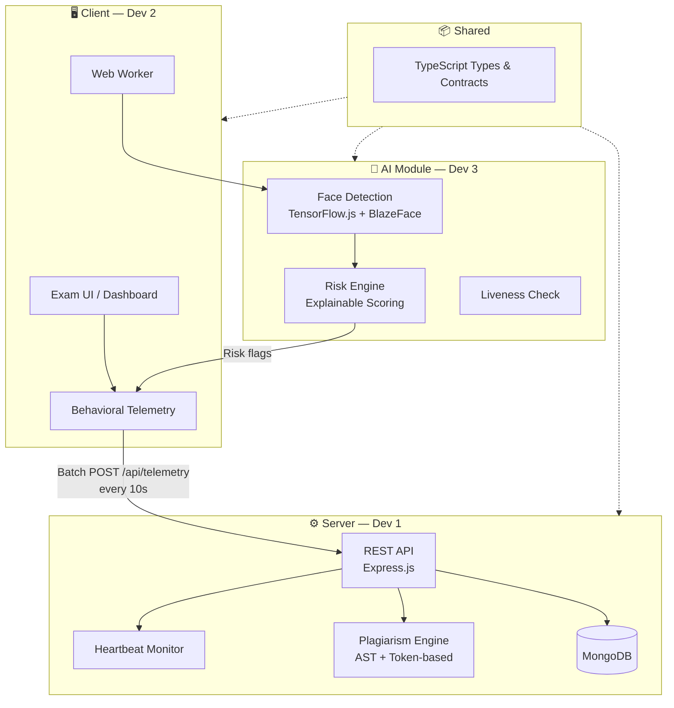

<div align="center">

# 🛡️ SIEGE

### AI-Powered Secure Assessment & Integrity Platform

[](LICENSE)
[](CONTRIBUTING.md)

*Next-generation online assessment platform with multimodal AI proctoring, behavioral analytics, and explainable risk scoring.*

</div>

---

## 📋 Problem Statement (PS-003)

Build a next-generation AI-powered online assessment platform capable of conducting large-scale **coding assessments**, **aptitude tests**, **technical MCQs**, and **certification exams** while ensuring exam integrity using **multimodal AI proctoring**, **behavioral analytics**, and **explainable risk scoring**.

The platform provides end-to-end assessment lifecycle management — from question creation and secure delivery to AI-powered evaluation, cheating detection, analytics, and candidate skill profiling.

---

## 🏗️ Architecture Overview



---

## 📂 Project Structure

```
siege/
├── client/              # Frontend — Next.js (Dev 2)
│   ├── src/
│   │   ├── app/         # Pages (auth, exam, dashboard)
│   │   ├── components/  # Reusable UI components
│   │   ├── hooks/       # Custom hooks (useProctoring, etc.)
│   │   ├── lib/         # API client, telemetry, HMAC
│   │   ├── workers/     # Web Workers for AI offloading
│   │   └── styles/      # Global CSS
│   └── README.md
│
├── server/              # Backend — Express.js (Dev 1)
│   ├── src/
│   │   ├── config/      # DB connection, env validation
│   │   ├── middleware/   # Auth, HMAC, rate limiting
│   │   ├── models/      # Database schemas
│   │   ├── routes/      # API route handlers
│   │   ├── services/    # Business logic (risk, plagiarism)
│   │   └── utils/       # Shared helpers
│   └── README.md
│
├── ai/                  # AI Models & Risk Engine (Dev 3)
│   ├── client-vision/   # TensorFlow.js face detection
│   ├── risk-engine/     # Explainable risk scoring
│   └── README.md
│
├── shared/              # Shared types & contracts (All devs)
│   ├── types/           # TypeScript interfaces
│   └── constants/       # Enums, thresholds
│
├── docs/                # Documentation & research
│   ├── architecture/    # System design, original plan
│   ├── research/        # Feature research
│   └── api/             # API documentation
│
└── .github/             # PR templates, issue templates, CODEOWNERS
```

---

## 👥 Team Ownership

| Role | Scope | Primary Folder |
|------|-------|----------------|
| **Dev 1 — The Vault** | Backend API, telemetry ingestion, plagiarism engine, DB | `server/` |
| **Dev 2 — The Gate** | Frontend UI, behavioral telemetry, AI integration in browser | `client/` |
| **Dev 3 — The Watcher** | AI models (face detection, liveness), risk scoring engine | `ai/` |
| **All Devs** | Shared TypeScript types and API contracts | `shared/` |

---

## 🚀 Quick Start

### Prerequisites

- **Node.js** ≥ 18.x
- **pnpm** (recommended) or npm
- **MongoDB** (local or Atlas)
- **Git**

### Setup

```bash
# 1. Clone the repo
git clone https://github.com/Sasivisvan/siege.git
cd siege

# 2. Copy environment variables
cp .env.example .env
# Edit .env with your values

# 3. Install dependencies (from each module)
cd client && pnpm install
cd ../server && pnpm install
cd ../ai && pnpm install

# 4. Start development servers
# Terminal 1 — Server
cd server && pnpm dev

# Terminal 2 — Client
cd client && pnpm dev
```

---

## 🤝 Contributing

Please read [CONTRIBUTING.md](CONTRIBUTING.md) before submitting any changes. Key rules:

- **Branch from `main`** using the naming convention: `feature/<module>/<description>`
- **Never push directly to `main`** — always open a Pull Request
- **One module per PR** — keep changes scoped to your folder
- Follow [Conventional Commits](https://www.conventionalcommits.org/)

---

## 📜 License

This project is licensed under the MIT License — see the [LICENSE](LICENSE) file for details.


---

## 📚 Documentation

| Document | Description |
|----------|-------------|
| [Features Research](docs/research/features.md) | Competitor analysis & feature inventory |
| [Architecture Plan](docs/architecture/plan.md) | AI & security design per developer |
| [System Design](docs/architecture/system-design.md) | End-to-end system architecture |
| [API Docs](docs/api/README.md) | API endpoint documentation |
| [Problem Statement](docs/problem_statement.png) | Original PS-003 brief |

