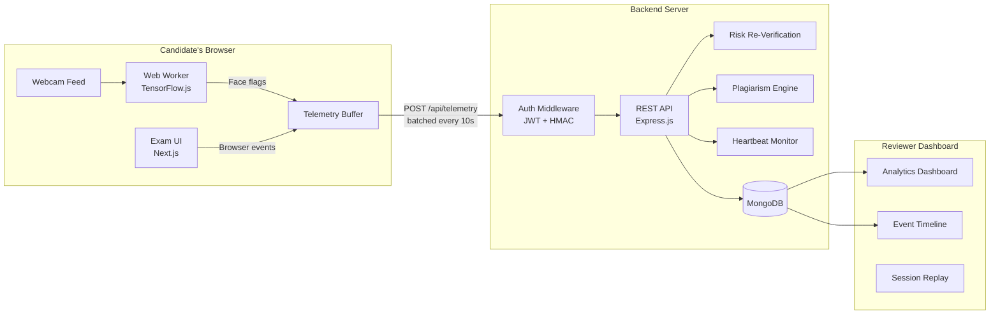
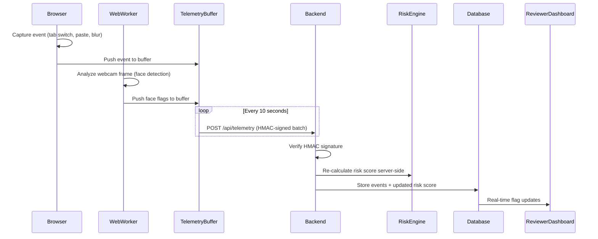
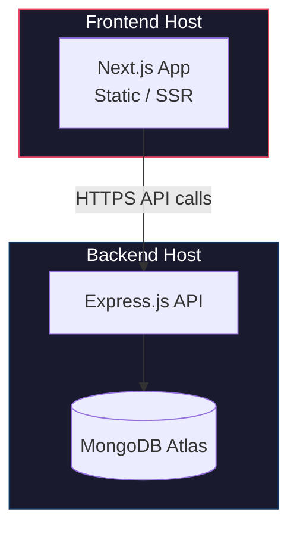

# System Design — SIEGE Platform

## Overview

SIEGE follows a **decoupled architecture** where the frontend and backend are hosted and deployed independently. The AI processing is split: heavy vision models run **client-side** (TensorFlow.js in a Web Worker) to avoid server load, while the backend handles telemetry aggregation, risk re-verification, and plagiarism detection.

---

## High-Level Architecture



---

## Event Pipeline

Every behavioral signal flows through a unified pipeline:



---

## Data Models

### TelemetryEvent
```typescript
interface TelemetryEvent {
  sessionId: string;
  candidateId: string;
  examId: string;
  timestamp: number;
  eventType: 'TAB_SWITCH' | 'COPY_PASTE' | 'FACE_MISSING' | 'MULTIPLE_FACES'
             | 'KEYSTROKE_ANOMALY' | 'HEARTBEAT' | 'LIVENESS_FAIL';
  metadata: Record<string, unknown>;
  questionIndex?: number;
}
```

### RiskScore
```typescript
interface RiskScore {
  sessionId: string;
  totalRisk: number;            // 0–100
  breakdown: RiskBreakdown[];
  explanation: string;          // Human-readable summary
  lastUpdated: number;
}

interface RiskBreakdown {
  eventType: string;
  count: number;
  contributedRisk: number;
  maxRisk: number;
}
```

---

## Risk Scoring Algorithm

```
Start at 0% Risk

+15% per Tab Switch (capped at 45%)
+20% per Copy-Paste event
+30% if Face Missing > 10 seconds
+50% if Multiple Faces > 5 seconds
+100% if HMAC signature fails (API Manipulation)

Final score = min(sum, 100)
```

Output example:
> `85% Risk — Critical. Candidate switched tabs 3 times. Multiple faces detected at 14:22 and 14:28. Code pasted directly into editor.`

---

## Security Architecture

### HMAC Payload Signing
- Frontend signs each telemetry batch with a session-specific HMAC secret
- Backend verifies the signature before processing
- Failed verification → 100% risk flag + exam lock

### Heartbeat System
- Client sends heartbeat every 30 seconds
- If backend receives no heartbeat for 30s → pause exam timer + lock candidate
- Prevents attackers from blocking `/api/telemetry` via DevTools

### Liveness Check
- Random prompts at exam start ("Look Left", "Smile")
- Uses face-api.js landmarks/blendshapes to verify real movement
- Defeats OBS Virtual Camera / looping video attacks

---

## Deployment Architecture



Frontend and backend are **deployed independently**:
- **Frontend**: Vercel, Netlify, or any static/SSR host
- **Backend**: Railway, Render, or any Node.js host
- **Database**: MongoDB Atlas (managed) or self-hosted

The client communicates with the server exclusively via REST API calls over HTTPS. There is no shared runtime or file system dependency between the two.
